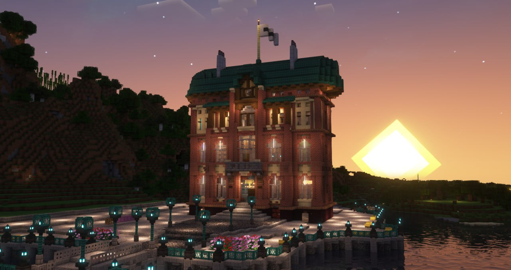

<!-- truncate -->

На основании решения Администрации HardShard, в Правила Сообщества вносятся следующие изменения:

1. Пересмотрен пункт 2.2 — были выделены умышленный и непредумышленный составы правонарушений, а также понятие мирового соглашения.

- Умышленный состав (пункт 2.2.1), формирующийся при наличии умысла из деяний, предусмотренных пунктом 2.2, делится на нарушения, совершённые как одним лицом, так и группой лиц по предварительному сговору. Исходя из данного разделения были повышены минимальные сроки наказаний. Так, за вредительство, совершённое одним лицом, следует наказание не ниже трёх суток блокировки, а в случае с группой лиц — не менее семи суток.

- Непредумышленный состав (пункт 2.2.2), формирующийся без наличия умысла из деяний, предусмотренных пунктом 2.2, подлежит администраторскому усмотрению в части назначения наказания либо неприменения санкционного аппарата.

- Введено понятие мирового соглашения пострадавших сторон (пункт 2.2.3). Стороны, в случае отсутствия претензий друг к другу, вправе обратиться к администратору, вынесшему наказание, с прошением о пересмотре данного решения. Также установлена возможность апеллирования решения через Администрацию HardShard. При этом новый пункт Правил не подлежит применению, если от действий, указанных в пункте 2.2 пострадало три и более сторон, в т.ч. неограниченный круг лиц, а также в случаях, когда деяния квалифицируются как непредумышленные.

2. Уточнён пункт 2.7.1 — понятие «внутриигровой суд» заменено на «высший внутриигровой суд» с целью предотвращения дробления судебных полномочий, связанных с применением административного санкционного аппарата, между неопределённым числом судебных органов в будущем. Вопросы, связанные со спорами вокруг Яйца дракона, подлежат разрешению только через наивысшую судебную инстанцию сервера.

3. Уточнён пункт 2.13 посредством введения пункта 2.13.3 — правила чёрного списка территорий не будут распространяться на администраторов Сообщества, находящихся при исполнении полномочий, а также на лиц, которым такой иммунитет предоставлен с целью наиболее полного исследования обстоятельств при нарушении Правил. Иммунитет представителей Администрации является бессрочным и абсолютным (в период исполнения полномочий), а у лиц, находящихся под следствием, — временным.

4. Изменён пункт 4.3 с целью его приведения к стандартам юридической техники.

5. Изменён пункт 4.8 — расширен круг возможных обязанностей лиц, привлекаемых Администрацией HardShard.

:::warning Внимание

Поправки вступают в силу 25 сентября 2024 г. (по московскому времени)

:::

**_Pereat mundus et fiat iusticia!_**