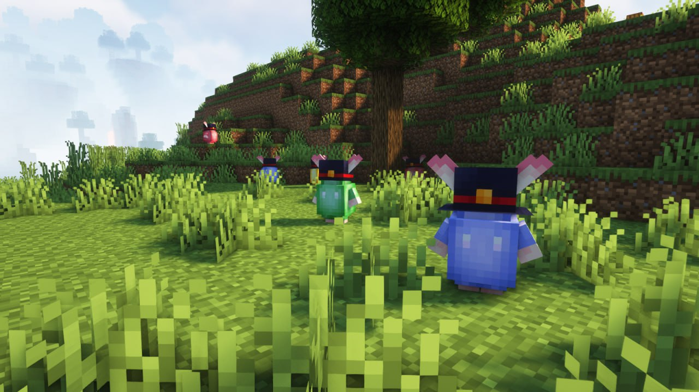
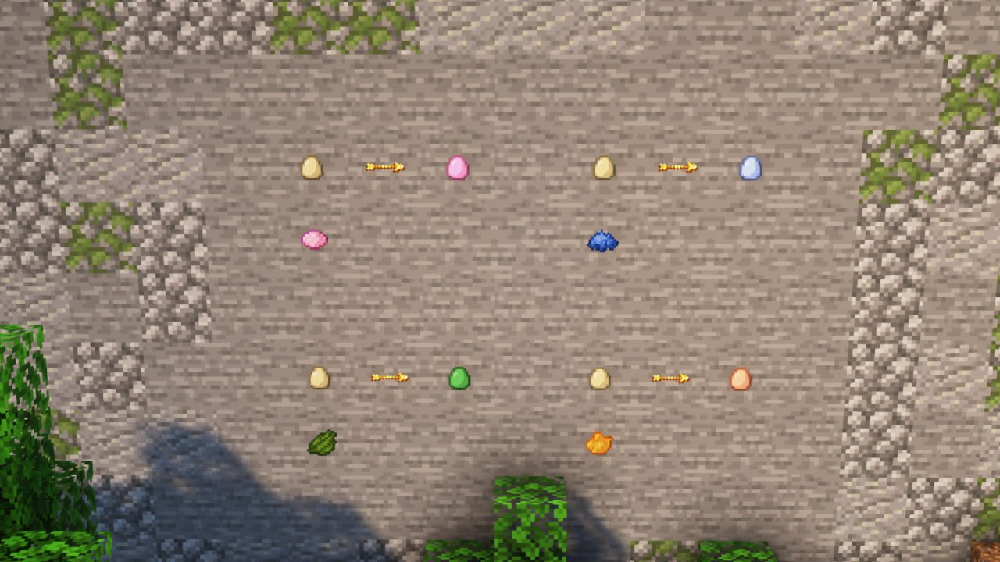
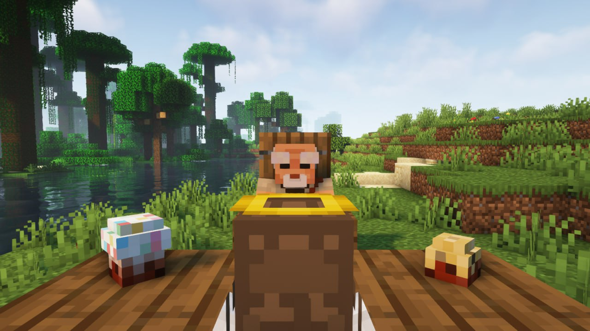

Надеемся, вы ещё не успели наесться куличами, потому что на сервере их будет много!

По улицам Анрими-Эссивы, (спавна), разбежались Яйкины — мирные ребята, но с очень крепкой скорлупой. Они обожают биться о крашенные пасхальные яйца, но даже самое крепкое яйцо можно разбить другим! 

<!--truncate-->

Используйте разноцветные пасхальные яйца, которые можно скрафтить из обычного куриного с использованием одного из четырёх красителей: оранжевым, синим, розовым или зелёным (также окрашенные яйца можно кушать!). Бейтесь ими с Яйкинами, и возможно, вы найдете внутри них что-то ценное! Или отнимете у них шляпу.

С Яйкинов падают куличики! Если скушать верхушку — ты будешь сытым, но что будет если съесть «невкусную» часть?

Когда в Анрими-Эссиве наберётся как **минимум 20 игроков**, небеса спустят благодать в виде огромного кулича! Придётся сильно постараться, чтобы съесть такое блюдо! Но каждому чревоугоднику воздастся, ибо каждый должен вкусить кулич в этот день!

Большой кулич благодатный не просто так, ведь внутри него сокрыты великие артефакты, которые однажды смогут уберечь вас от неминуемой гибели!

_Секрет гигантского кулича должен быть раскрыт!_
