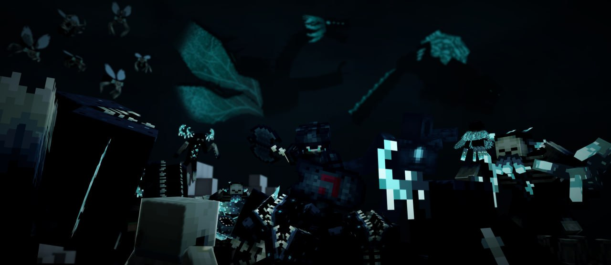

**Приближается Час сумерек...**

Тьма сгущается над нашим миром. С каждым днём из разломов вырываются всё больше Порождений Глубин. Отважные герои, вы уже доказали свою смелость, закрывая тёмные разломы по всему миру. Но этого оказалось недостаточно.

<!-- truncate -->

Лишь закрыв **Великий разлом** Анрими-Эссивы можно будет положить конец бедствиям и предотвратить наступление кошмара.

Все, кто могут держать оружие, должны собраться в это воскресенье, **17 августа, в 20:00 по МСК** у Великого разлома **(x-370 z-300)**, где их встретит отряд дворфов под предводительством Хрейдмара.

Времени на подготовку осталось мало, поэтому воспользуйтесь им с умом! В преддверии приближающегося **Часа сумерек** вы всё ещё можете побороться с Тёмными, закрыть малые разломы, а также выковать **новое вхакангитовое снаряжение**. 

Подробнее о новых опасностях и наградах вы сможете узнать в [этой статье](https://teletype.in/@murlocproger/tides_of_darkness_final).

**Когда сойдутся сумерки и сталь, судьба мира будет решена...**
