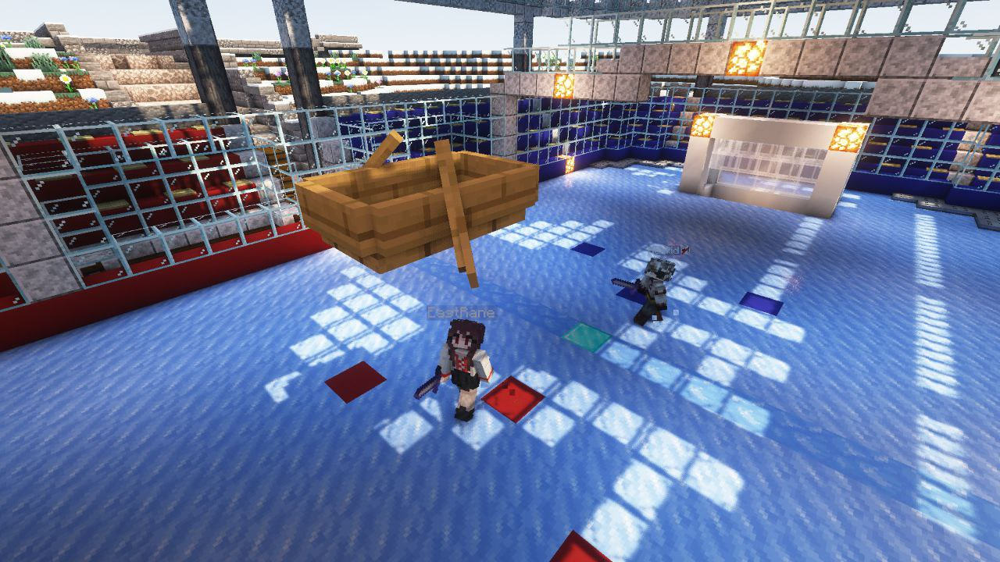

import { PhotoNamePlayer } from "@site/src/components/PhotoNamePlayer"

Арена для хоккея в зоне игр построена уже достаточно давно, однако турнир до сих пор не был проведён. Пришло время это исправить!

<!--truncate-->

Открыта запись на международный турнир по хоккею!
- Арена находится в Зоне Игр, местоположение которой вы можете узнать, воспользовавшись [картой Надбедрочья](https://t.me/hardshard_newspaper/304).
Если вы дворф, координаты в обычном мире — `540, 126, -625`
- Время начала турнира будет определено после регистрации всех команд, ориентировочные даты проведения: 30 сентября – 1 октября.
- На турнир могут зарегистрироваться все желающие, для этого нужно написать в ЛС [@Nerkid](https://t.me/nerkid) и указать никнеймы участников вашей команды из двух человек и название команды (название может быть любым, но в рамках приличия). Также можно указать игроков на замену на случай отсутствия одного из участников на время проведения турнира.
- Победившая команда получит декоративный след из частиц и трофей в виде уникальной головы.
- Регистрация открыта до 27 сентября включительно.

После регистрации всех участвующих команд отдельным постом будет опубликована турнирная таблица и объявлено время проведения. 

Также как и на прошлом турнире, если у вас нет сокомандника, но вы хотите принять участие — подавайте заявку на регистрацию. Мы добавим вас в общую таблицу, после чего вы сможете собрать команду из других таких же «одиночек».

В данной игре в роли шайбы выступает лодка, а клюшками являются каменные мечи на отдачу. Игроки выпивают зелье слабости (в турнире будет использоваться напиток «Изотоник Пина-Канада», который даёт слабость на продолжительное время), благодаря чему удары не ломают лодку.