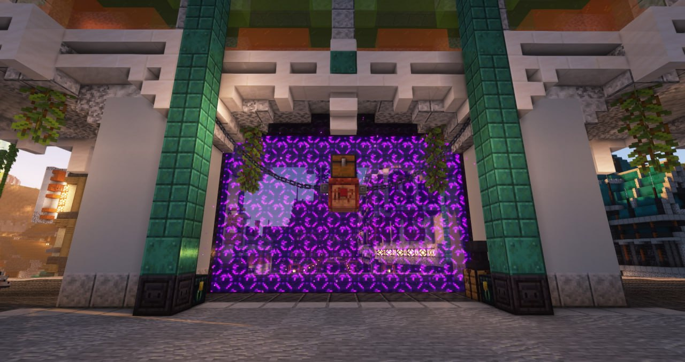

<!--truncate-->

- Полностью заменена система отделки инструментов, теперь для отделки инструментов нужны специальные кузнечные шаблоны, всего их 4 вида;
- Исправлены недочеты перевода;
- Восстановлен крафт наблюдателя;
- Восстановлен крафт поршня;
- Иконки чата для сообщений из Telegram/Discord теперь отображаются корректно;
- Устранены графические артефакты в области игрового чата;
- Прочие технические исправления работы ресурс-паков;

Вся информация по изменённой системе отделок для инструментов будет описана позднее в статье, прикреплённой к анонсу обновления. Новые отделки для копирования можно взять в сундуке у портала в Анрими-Эссиве (спавн). 

Обращаем ваше внимание, что за кражу, а не копирование шаблонов будут применяться санкции согласно Правилам.