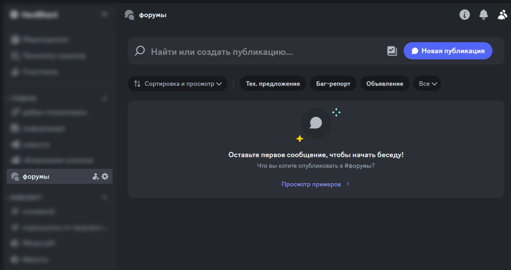

Многие из вас имеют определённые предложения по улучшению нашего сервера: давно озвученные, но забытые; интересные, но требующие обсуждения; придуманные в голове, но пока не представленные общественности. Однако мы сталкиваемся с большой проблемой, поскольку все те идеи, которые звучат в чате, часто теряются в потоке прочих сообщений. В связи с этим на нашем [Discord-сервере](https://discord.com/invite/huVNRvAjZq) появились **форумы**.

<!-- truncate -->

Каждый из вас может публиковать свои внутриигровые и технические предложения, искать людей для проектов и сообщать Администрации о различных багах и прочих недостатках всех составляющих нашего сообщества. Данный формат предоставляет немало удобств — свободный постинг без обращения к модераторам, а также система тэгов, которые позволяют сортировать посты по интересующим вас темам. 

Настоятельно рекомендуем вам публиковать или дублировать все ваши идеи на форумах, чтобы они избежали забвения и с большей вероятностью дошли до реализации!