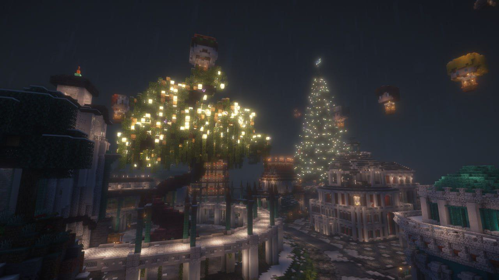

Новогодняя пора вновь пришла в наши дома, наполнив их атмосферой добра и радости, а также приятными рутинными делами, ставшими уже практически ритуальными. В эту пору мы стараемся окончить все свои обычные дела, уладить рабочие моменты, чтобы всецело окунуться в грядущее торжество.

<!-- truncate -->

Новогодний период славен своей душевной светлостью, единящей людей различных национальностей, вероисповеданий, политических и иных принадлежностей. Этот праздник напоминает нам о великой ценности и важности любви и дружбы, о необходимости установления взаимопонимания между разными по духу людьми и их мирного сосуществования. 

Надежда в последние годы стала важной составляющей нашей жизни, без которой жить становится практически невыносимо. На это продолжают влиять различные обстоятельства, которых мы бы никогда не хотели, но которые продолжают быть с нами. Однако крайне тёмные времена, в которых нам удосужилось жить, пробиваются светом человеческой общности и единства перед лицом невиданных атак, подтверждение чему все мы нашли в марте уходящего года.

В этом году, как и ранее, нашей миссией было поддержание хрупкого равновесия между всеми игроками, а также совершенствование проекта по мере сил и возможностей. Безусловно, не все идеи получили своё воплощение, не все обещания, данные нами, были исполнены, не все поставленные цели были достигнуты. Кризисы, с которыми мы столкнулись в уходящем году, оказали серьёзное влияние и на нас, и на комьюнити. Тем не менее, имея уверенность в своих действиях и надеясь на всеобщую помощь игроков, надеемся впредь более внимательно относиться к своим возможностям и запросам людей, чтобы далее успешно развивать Сообщество в тесной взаимосвязи. 

Пускай 2024 год оказался далеко не самым насыщенным по активности, но он был наполненным различными большими и не очень событиями. Мы искренне благодарны всем игрокам, принявшим участие в организации и проведении различных ивентов – их вклад сложно переоценить. Мы также благодарны всем тем, кто поддерживал и поддерживает нас в эти нелёгкие времена. Верим, что общими усилиями нам удастся преодолеть любые трудности и сделать наш проект особенным.

В канун Нового года окружающий нас мир наполняется чем-то невообразимым, знакомым и очень приятным. Новогоднее чудо, впитав в себя традиции рождественских празднований, состоит в том, что все мы вспоминаем об общих традициях и ценностях, объединяющих людей. Мы вновь начинаем верить в волшебство, в чарующую магию праздника, в дружбу и любовь, а это приводит к тому, что все мы становимся ближе и счастливее. Это то, о чём всем нам нужно помнить вне зависимости от обстоятельств.

Как сказал в одном из своих произведений всемирно известный классик: «Можете быть уверены, настанут лучшие времена».

**Мы желаем вам мирного и счастливого Нового года!**