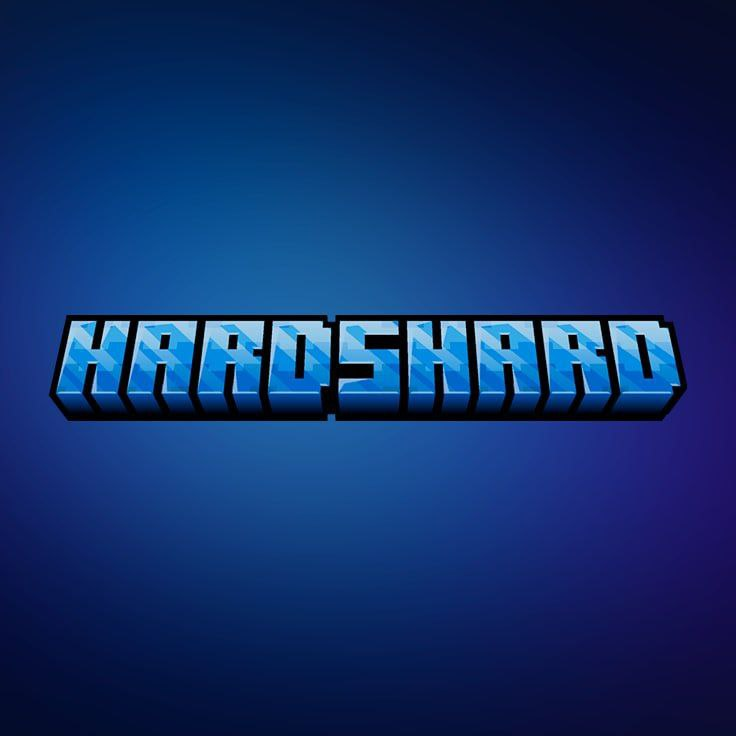

Пришло время разъяснить для тех, кто не был на ночной пресс-конференции, что же произошло и почему мы теперь называемся HardShard.

<!--truncate-->

Некоторое время назад [Игорь Fromgate](https://vk.com/fromgate) сообщил нам о том, что в будущем ему, возможно, понадобится домен `play.minecraftmain.ru`. Поэтому мы решили не рисковать и к концу 2 сезона освободить данный домен, и провести ребрендинг (что, собственно, вы сейчас и наблюдаете). Все чаты и каналы остаются как есть, изменилось лишь название.

Новый сезон, для того чтобы не было путаницы и сохранилась правопреемственность, будет по счёту третьим и стартует сегодня. Планируется много косметических и геймплейных изменений, о которых более подробно мы расскажем позже в отдельной статье.

Сервер межсезонья продолжит свою работу как ответвление основного проекта и отныне будет просто модовым сервером HardShard. Текущая сборка модов будет стоять до тех пор, пока этого будут желать игроки.

В ближайшее время также будет запущен сервер Vintage Story и станет отдельным проектом в рамках нашего сообщества.
