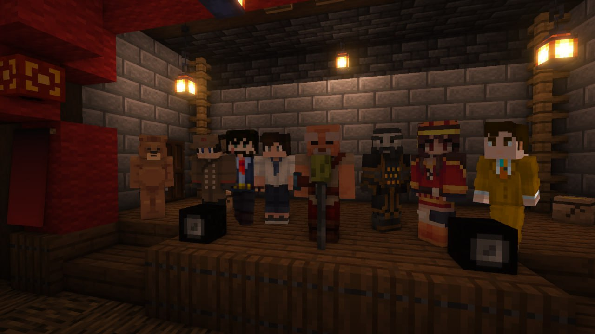

Администрация HardShard всегда старается сделать ваш игровой опыт более приятным, но ни для кого не секрет: Администрация недостаточно эффективна. Некоторые проблемы тянутся неделями, обратная связь временами оставляет желать лучшего, а кто из администраторов чем занимается так и вовсе непонятно.

<!-- truncate -->

Сегодня мы готовы заявить о проведении реформы в Администрации HardShard. Вся система была полностью пересмотрена, в результате чего каждый администратор получил подходящие ему должности с соответствующими правами и обязанностями.

Благодаря реформе мы будем работать более активно, свободно и отзывчиво, а вы обретёте понимание о том, какой администратор ответственен за конкретный вопрос.

Настоятельно просим ознакомиться с информацией у нас [на сайте](/docs/admins). Мы очень старались, и у админов там немало нового.

> На приложенном изображении вы можете увидеть текущий состав Администрации (в нём нет подвоха, не стоит его искать)
>
> — Прим. ред.