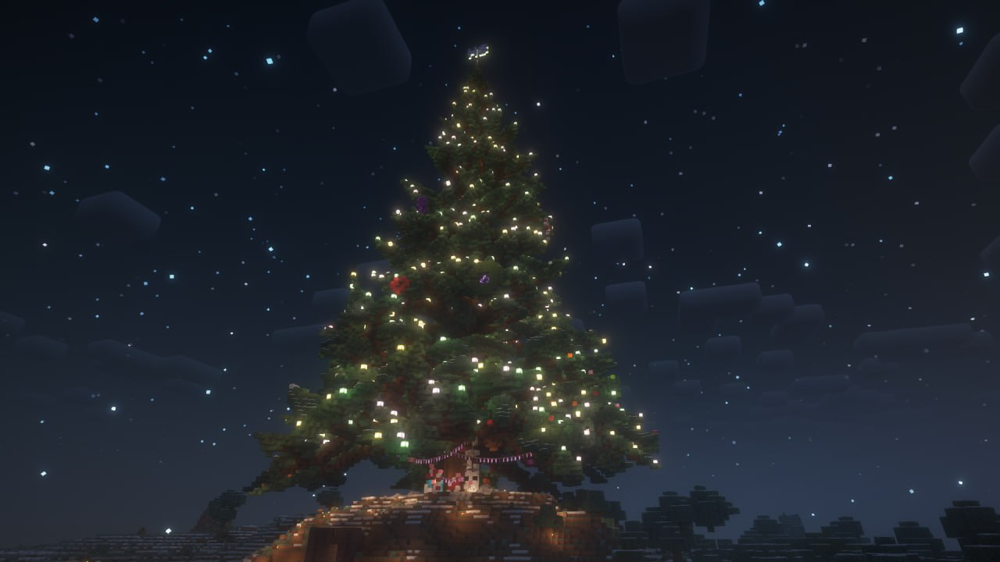

В этом году мы решили немного изменить правила и сделать их более приближенными к оригинальным, чтобы создать больше интриги и каждый участник смог гарантированно получить подарок.

<!-- truncate -->

Отныне сбор и раздача подарков будут анонимными. Для участия вам нужно собрать и принести подарок любого содержания (в рамках Правил, разумеется) под Главную новогоднюю ель в Анрими-Эссиве до 26 декабря включительно. Это может быть как одиночный шалкер, так и многоблочная структура — всё зависит лишь от вашей фантазии.

:::warning Убедительная просьба

Если вы дарите одиночный шалкер, то накройте его сверху полублоком, чтобы нельзя было увидеть его содержимое. В случае, если вы являетесь дворфом и используете бочки вместо шалкеров, рекомендуем закрывать их блоками со всех сторон.

:::

После того как вы оставите подарок под елью, напишите [@avokneruyt](https://t.me/avokneruyt) в личные сообщения о том, что вы принимаете участие в ивенте. Это нужно для понимания точного количества участников.

Мы предлагаем вариант для проведения празднования Нового года всем вместе, не ограничивая вас в самостоятельном изготовлении и вручении подарков вне рамок ивента.

Время и место встречи для получения подарков будет объявлено **позже** в отдельном посте.

**Координаты Новогодней ели:** `150, 82, -185`

_С наступающим Новым Годом и Рождеством!_

Чтобы принять участие в Тайном Осколике, положите переименованную бумажку со своим никнеймом в синий шалкер на верхней грани подарка в Анрими-Эссиве. 

Время, когда можно будет получить никнейм игрока, которому вы будете делать подарок, а также место, куда их можно будет принести, будет объявлено позже отдельным постом.

Координаты рандомайзера: `13, 71, 56` (за порталом в Надбедрочье).

Однако это не все сюрпризы. Мы подготовили [видео](https://youtu.be/bx-OBenvd3A), в котором более подробно рассказывается о Тайном Осколике и другом нововведении.