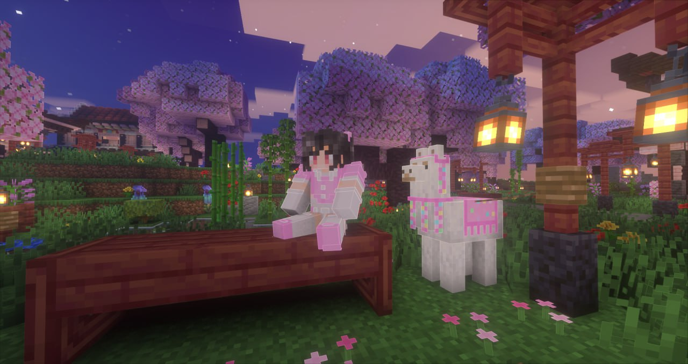

import { PhotoNamePlayer } from "@site/src/components/PhotoNamePlayer"

Предлагаем вам под конец недели поучаствовать в Своей Игре с вопросами по истории нашего сервера! Пак для игры старательно на протяжении недели собирала [@avokneruyt](https://t.me/avokneruyt), которую вы знаете под ником <PhotoNamePlayer nickname="mamochkaa"/>.

<!--truncate-->

Вопросы включают в себя всю историю проекта, начиная с первого сезона, так что вам будет полезно освежить в памяти или узнать её вновь, прочитав отчёты. Полное собрание отчётов первого сезона вы можете найти [здесь](https://telegra.ph/Pervyj-sezon-MainSMP-podvedenie-itogov-12-11).

Присоединяйтесь к 20:00 по МСК к нашему [Discord-каналу](https://discord.gg/2tHYZcJYR3) в голосовой канал «флуд». Если вы ещё ни разу не участвовали в Своей Игре, необходимо установить ПК-клиент, который вы можете найти [здесь](https://vladimirkhil.com/si/game). Также существует [онлайн-версия](https://vladimirkhil.com/si/online/), однако ПК-версия является более предпочтительной.

Победитель получит символический приз в размере 2 стаков алмазов на основном сервере.

> SIGame — адаптированная для игры на персональных компьютерах версия телеигры-викторины Своя Игра, которая транслируется на НТВ с 1994 года по сей день
> 
> — Прим ред.