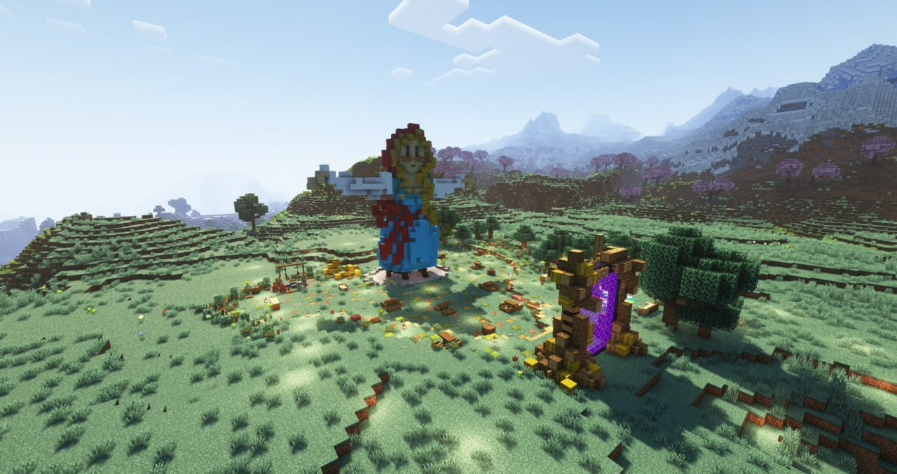

В честь данного события на сервере стартует фестиваль **Burning Baba**, суть которого в вашем самовыражении. У вас есть уникальная возможность построить любой арт-объект (не нарушая [Правила](/docs/rules)) и внести свой вклад в образование музея под открытым небом.

<!-- truncate -->

Вы можете использовать всё пространство вокруг площадки с чучелом, включая горы, реки и близлежащие равнины. Убедительная просьба — перед началом строительства, огородите пространство, которое вы будете использовать и поставьте табличку с вашим ником, чтобы другие игроки понимали, какое место свободно.

Событие продлится неделю до **17 марта** включительно, в последний день состоится ритуальное сожжение чучела, которое ознаменует конец фестиваля, недели масленицы и символическое полноценное наступление весны. 

На центральной площадке расположены обеденные столики, столб для забавы **«Царь горы»**, а также зона для умиротворённых бесед.

Позднее на сервер будут добавлены тематические предметы для поддержания атмосферы праздника, информация об этом будет опубликована отдельным постом.

После окончания фестиваля будет проведён конкурс, на котором определится самая интересная, необычная и оригинальная постройка, строитель(-и) которой получит(-ят) вознаграждение. 

Место проведения:
- Надбедрочье: `588, 129, -156` (Жёлтая ветка)
- Верхний мир: `4718, 93, -1341`

По вопросам, связанным с проведением фестиваля пишите в комментариях к данному посту или в личные сообщения [@Flammablelion](https://t.me/flammablelion).