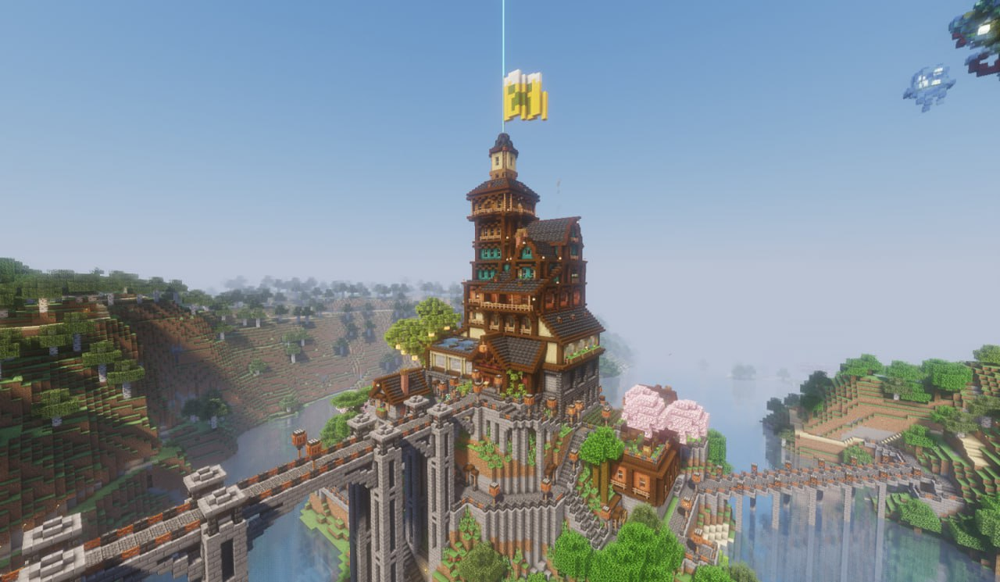

import { PhotoNamePlayer } from "@site/src/components/PhotoNamePlayer"

Осень наступила, на улице холод и слякоть — идеальное время чтобы согреться в уютной атмосфере четвёртого творческого вечера!

Он состоится **в субботу, 12 октября, в таверне «Пьяный Крипер»**.

<!-- truncate -->

Для старичков и новичков напомним суть грядущего события. Творческий вечер — это мероприятие, на котором каждый может проявить свои таланты и способности, воплотив их в своём выступлении. Это может быть что угодно: театральная сценка, стендап, песня, анекдоты, аукцион, конкурсы — всё то, на что хватит вашей фантазии. В таверне присутствует сцена, на которой можно соорудить любые декорации, подготовить одежду — словом, сделать всё необходимое для полноценного выступления.

:::note Примечание ООТВ

В этой версии таверны не предусмотрена гримёрка

:::

Время сбора гостей будет определено за день до начала мероприятия, то есть в пятницу, 11 октября. Тогда же будет опубликована финальная афиша в отдельном посте.

Если вы хотите принять участие — напишите в ЛС [@Flammablelion](https://t.me/flammablelion) и укажите формат вашего выступления, а также примерное количество времени, которое оно займёт. После регистрации всех участников будет определено примерное время начала каждого номера.

Всё мероприятие ориентировочно будет проходить в промежутке с **20:00 до 22:00** по МСК. Время проведения может быть изменено в зависимости от количества номеров и пожеланий участников.

В качестве хедлайнеров мероприятия выступят <PhotoNamePlayer nickname="Notna69" /> и <PhotoNamePlayer nickname="jayz1123" />, которые порадуют публику игрой на укулеле и гитаре. Ведущим вечера будет несравненный <PhotoNamePlayer nickname="Pedrilko" />.
