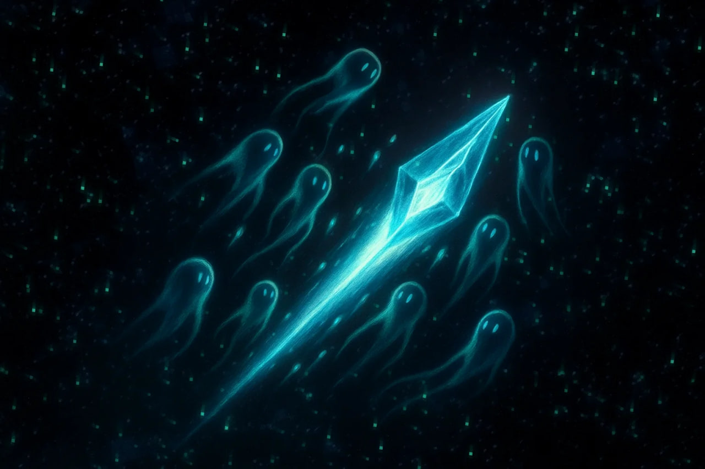

**Друзья!**

Вот и подошёл к концу **третий сезон** нашего проекта, ставший, пожалуй, самым непростым в истории Сообщества. Он стал непростым для всех — как для игроков, так и для администрации. Мы запомним этот сезон полным **неизвестностей, испытаний, а также беспрецедентных вызовов**, с которыми никогда ранее сталкивались. Данные трудности дали всем бесценный опыт, которым мы непременно будем руководствоваться в будущем.

<!-- truncate -->

Тем не менее, очередная эпоха в развитии сервера гораздо сильнее отложится в памяти обилием насыщенных событий, уровень проработки которых кратно возрос. Кроме того, нельзя обойти стороной и не менее сложное занятие в виде строительства городов, баз и иных поселений, без которых мир казался бы совершенно пустым и безлюдным. Задумки, реализованные игроками, нередко поражали воображение и становились предметом обсуждений.

Разумеется, нельзя обойти стороной финальный ивент. Спасибо всем тем, кто смог принять участие в нём и не побоялся дать бой глубинным ужасам, а также почувствовать на своей шкуре влияние на мир этого. 

**Отдельно выражаем особую благодарность** [@murlocproger](https://t.me/murlocproger) техническому специалисту Администрации, который практически в одиночку смог разработать и на высоком уровне реализовать это венчающее весь сезон мероприятие.

**Администрация HardShard также выражает свою искреннюю благодарность** всем участникам Сообщества, принявшим участие в жизни этого сезона. Без вас нам не было бы смысла поддерживать этот проект и развивать его. Несмотря на все те сложности, какие имели место, мы рады, что вы остаётесь с нами! 

Сообщаем вам, что часть Администрации уходит в небольшой отпуск, после которого нами будет продолжена активная работа над **четвёртым сезоном**, старт которого запланирован **после выхода осенней версии игры**. Кроме того, в процессе разработки **мы будем учитывать мнения участников Сообщества** по всесторонним вопросам развития. 

Продолжайте следить за новостями в наших социальных сетях — впереди много интересного!

**С уважением и огромной признательностью, Администрация HardShard.**
