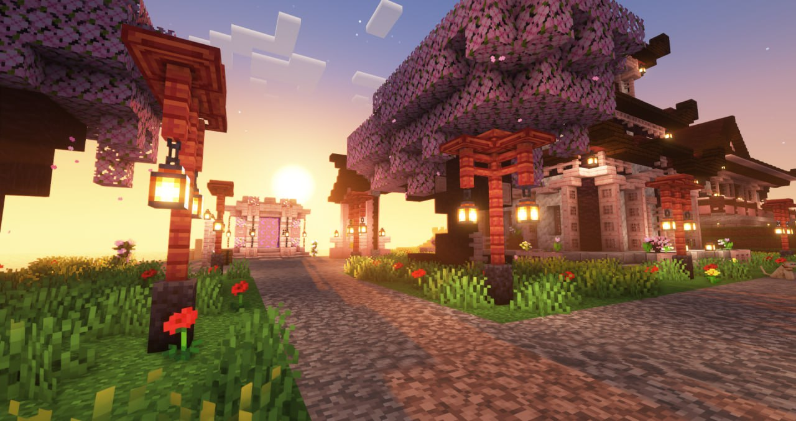

import { PhotoNamePlayer } from "@site/src/components/PhotoNamePlayer"

С начала третьего сезона не прошло и месяца, но время для третьего творческого вечера уже наступило!
Он состоится в субботу, 26 августа, на открытии «Муркафе» в Мурляндии.

<!-- truncate -->

Правила остались прежними, каждый желающий может принять участие и сделать своё выступление. Это может быть что угодно: сценка, стендап, песня, рассказ анекдотов , аукцион, конкурсы — всё, на что хватит вашей фантазии. В кафе будет присутствовать сцена, на которой можно будет поставить декорации, подготовить одежду и др. для вашего полноценного выступления.

> **Просьба воздержаться от анекдота про гвозди** 
>
> — <PhotoNamePlayer nickname="Flammablelion" />   

Время сбора гостей будет определено в пятницу, за день до начала мероприятия. В это же время будет опубликована финальная афиша в отдельном посте.

Если вы хотите принять участие — напишите в ЛС [@Flammablelion](https://t.me/Flammablelion) и укажите формат вашего выступления и примерное количество времени, которое оно займёт. После определения всех новых участников, время начала выступления будет определяться индивидуально.

В качестве хедлайнеров мероприятия вы сможете увидеть:

- <PhotoNamePlayer nickname="Notna69" />, которая сыграет несколько песен на укулеле собственного и не очень сочинения,
- <PhotoNamePlayer nickname="Pedrilko" />, известный всем своими анекдотами, 
- <PhotoNamePlayer nickname="KOK_MAN" />, запомнившийся чтением стихов на прошлом вечере,
- а также других секретных гостей (надеемся, что они смогут принять участие).
