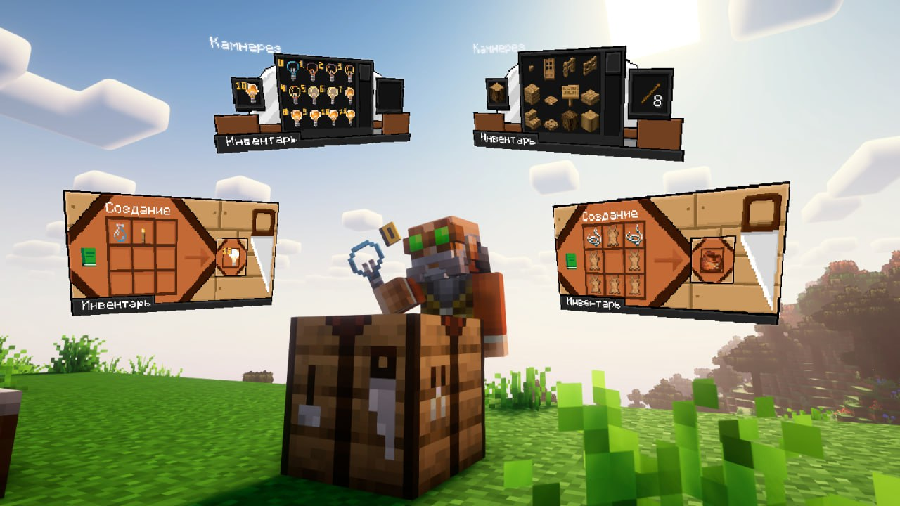

import { PhotoNamePlayer } from "@site/src/components/PhotoNamePlayer"

Сегодня были внесены некоторые дополнения на основе предложений игроков.

<!-- truncate -->

## Список изменений

- Кадавры теперь имеют шанс дропа песка (тип песка зависит от типа биома, в котором он заспавнился).\
Предложил: <PhotoNamePlayer nickname="Gohtar" />
- Добавлен крафт мешочка (был на 2 сезоне).
- Расширен функционал камнереза — теперь он может обрабатывать древесину.\
Предложили: <PhotoNamePlayer nickname="Pedrilko" /> и <PhotoNamePlayer nickname="Flammablelion" />
- Теперь, если убийца находится под эффектом «Невидимость», его имя будет скрыто в сообщении об убийстве (использовать только в РП моментах).\
Предложил: <PhotoNamePlayer nickname="Pedrilko" />
- Добавлен крафт невидимого света. Положите в окне крафта пустую бутылку и факел. Чтобы выбрать уровень освещённости — положите предмет в камнерез. Чтобы убрать поставленный свет — установите на его место любой плотный блок.\
Предложил: <PhotoNamePlayer nickname="Nerkid" />
- Добавлен рецепт напитка для хоккея, который даёт эффект слабости на продолжительное время. 

  Рецепт напитка прост — в кипящий котёл добавьте следующие ингредиенты:
    - ведро молока 1 шт;
    - плотный лёд 3 шт;
    - сахар 4–6 шт;
    - комок глины 2 шт;
    - яйцо 2 шт.
      
  Доведите до кипения и держите на огне 1–2 минуты, после чего разливайте по бутылкам!\
Предложил: <PhotoNamePlayer nickname="yantar1k" />