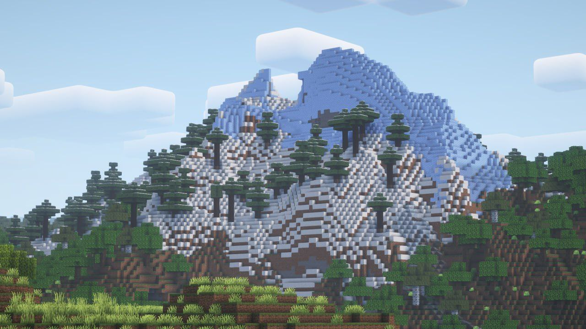

Технические работы завершены, основной сервер запущен на версии 1.21.1 и работает в штатном режиме!

<!-- truncate -->

К сожалению, при переходе на новую версию были удалены датапаки, добавляющие настольные игры и возможность создавать вертикальные железные люки.

Также существуют проблемы с плагином, который добавляет новые рецепты для камнереза и плавильной печи. Наш технический администратор [@whatissleep626](https://t.me/whatissleep626) уже занимается обновлением данного плагина.

В случае нахождения каких-либо проблем в работе сервера, обращайтесь в личные сообщения [@GottorRB](https://t.me/GottorRB).

Напоминаем, что для более удобного обновления вы можете использовать [официальный модпак](https://modrinth.com/modpack/hardshard-modpack/version/1.21.1). Если вам нужны моды отдельно, скачайте архив для MultiMC и найдите в нём папку mods.

Желаем вам приятной игры!
